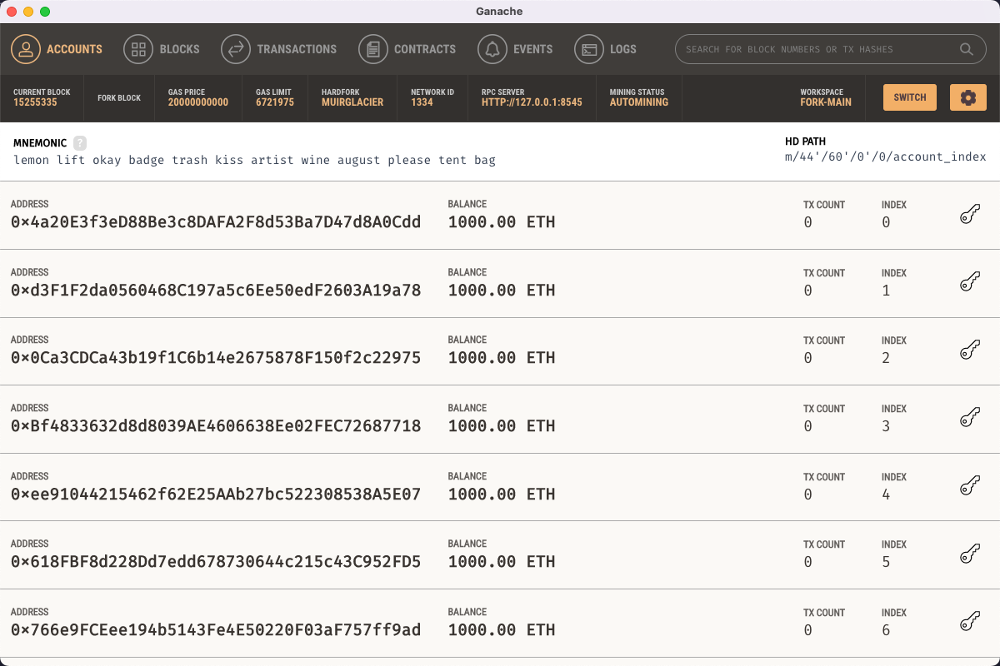
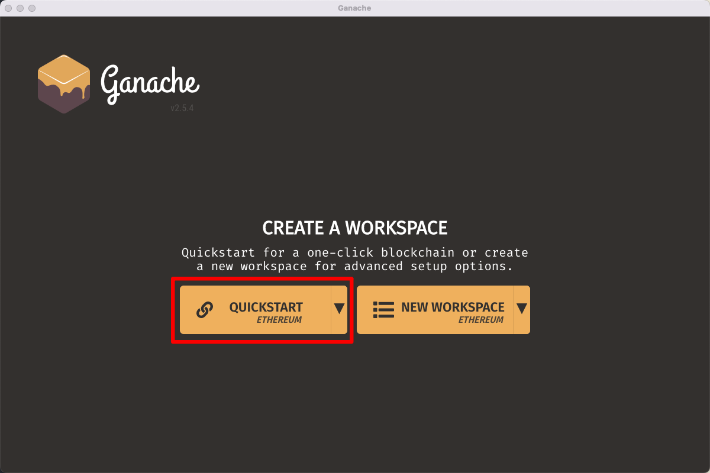
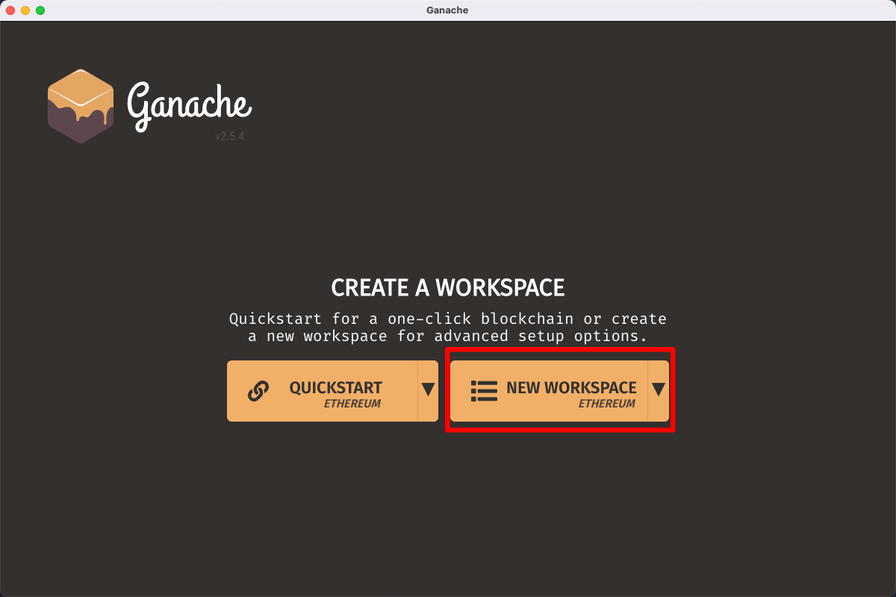
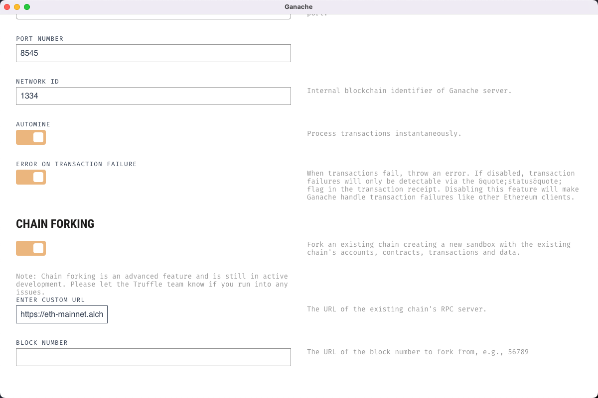
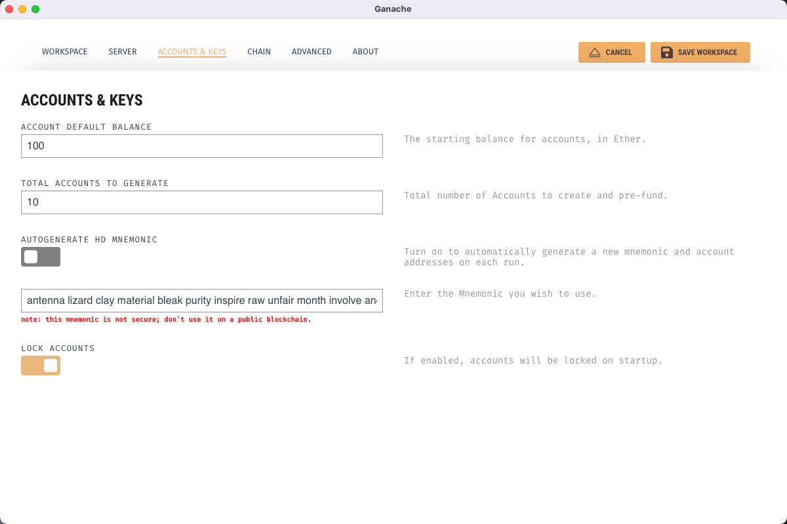
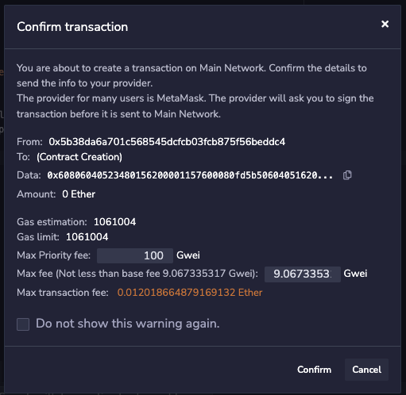

# WTF Solidity极简入门-工具篇3：Ganache，搭建本地测试网络

我最近在重新学 Solidity，巩固一下细节，也写一个“WTF Solidity极简入门”，供小白们使用（编程大佬可以另找教程），每周更新 1-3 讲。

推特：[@0xAA_Science](https://twitter.com/0xAA_Science)｜[@WTFAcademy_](https://twitter.com/WTFAcademy_)

社区：[Discord](https://discord.gg/5akcruXrsk)｜[微信群](https://docs.google.com/forms/d/e/1FAIpQLSe4KGT8Sh6sJ7hedQRuIYirOoZK_85miz3dw7vA1-YjodgJ-A/viewform?usp=sf_link)｜[官网 wtf.academy](https://wtf.academy)

所有代码和教程开源在 github: [github.com/AmazingAng/WTF-Solidity](https://github.com/AmazingAng/WTF-Solidity)

-----

`Ganache` 是一个适用于 “开发场景”（或开发过程中的）的 **以太坊区块链网络**，它使开发以太坊应用程序（的工作）更快、更容易、更安全。它包括所有流行的 RPC 功能和特性（如事件），并且可以确定性地运行以使开发变得轻而易举。

> 可以理解 ganache 是一个以太坊区块链“模拟器”，在开发过程中 “模拟” 生产环境、方便的获取合约调用的上下文。

> ⚠️ 注意：**请不要在生产环境中作为区块链网络使用** 如果需要请使用 geth 或 openethereum 等节点应用。

`Ganache` 同时有着 GUI 版本，适合于新手快速配置使用。

## Ganache 的项目设施

- 官网：[https://trufflesuite.com/ganache/](https://trufflesuite.com/ganache/)
- 文档：[https://trufflesuite.com/docs/ganache/](https://trufflesuite.com/docs/ganache/)
- Github：
  - UI: [https://github.com/trufflesuite/ganache-ui](https://github.com/trufflesuite/ganache-ui)
  - CLI: [https://github.com/trufflesuite/ganache](https://github.com/trufflesuite/ganache)
  - 旧版（已弃用）: [https://github.com/trufflesuite/ganache-cli](https://github.com/trufflesuite/ganache-cli)
- 适用于命令行/npm的文档：[https://trufflesuite.com/blog/introducing-ganache-7/](https://trufflesuite.com/blog/introducing-ganache-7/)


> ⚠️ 注意：Ganache 的官网中的 Github repo 为UI版本。CLI 版本在 npm 中有 `ganache` & `ganache-cli`，其中 `ganache-cli` 已被弃用。

## 为什么要使用Ganache？

Ganache 的主要功能有：
- 开箱即用，快速启动一个EVM区块链网络（可以设置 miner、出块时间）；
- 方便的 fork（分叉）已经存在的区块链网络（无需等待区块同步）；
- [使用 `console.log`](https://github.com/trufflesuite/ganache#consolelog-in-solidity) 在 Solidity 开发过程中方便的调试，；
- [快进时间（Fast-forward time）](https://trufflesuite.com/blog/introducing-ganache-7/#6-fast-forward-time)，模拟智能合约在未来时间的状态；
- 模拟任何一个账户（你可以无需私钥模拟环境中使用任意用户的Token）；

有的时候想要实现合约的测试，或者一些合约开发，你需要去测试网领取eth。有时候faucet又没有eth可以领取，这个时候，其实你可以选择自己在本地 fork 一个网络，想要多少eth都可以直接生成。原理是 fork 一个主网的网络运行在本地（或是可以称作运行在本地的 Chain）。

fork主网还有一个好处，你可以直接mock现在主网上的所有环境，比如dex交易所的代币余额等，你知道合约地址，可以直接进行测试和交换使用等。

## 命令行安装（推荐）

[完整包的说明 ganache - npm](https://www.npmjs.com/package/ganache)
```shell
npm install ganache --global
```
您也可以单独安装该项至您的项目目录（在不使用 `--global` 的情况下）编写 `package.json` 中的 script 配置启动。  
在 Ganache 7 后您可以在 node.js 的 Javascript 脚本中引入并直接使用。它将会提供一个 [EIP-1193(Ethereum Provider JavaScript API)](https://eips.ethereum.org/EIPS/eip-1193) provider、一个 JSON-RPC 服务端、Web3.js & ethers provider。同时您也可以在[浏览器中](https://github.com/trufflesuite/ganache#browser-use)使用它。


### 启动GANACHE

```shell
ganache
```

### 帮助 / 说明
```
ganache --help
```
通过帮助，你可以了解 ganache 的主要功能和相关配置方法、参数。这其中包括：
- **Chain**: 设置网络的版本、ID、时间、合约大小限制、hardfork的版本规则；
- **Database**: 设置保存链到数据库；
- **Logging**: 设置 EVM opcodes、RPC 请求和响应的 log；
- **Miner**: 设置矿工，包括：出块时间、默认的 gas price、Txn gas limit、难度、instamine、价格上涨；
- **Wallet**: 设置钱包的默认余额、解锁钱包；
- **Fork**: 分叉（fork）网络的设置包括：fork 目标网络 RPC URL、块高、userAgent、缓存策略，支持提供用户名/密码（如果目标 RPC 存在 Basic Authentication）；
- **Server**: 设置本地 Chain 的监听地址&端口；
### Fork 主网启动

以下命令会自动生成10个eth账号，每个账号带有100eth的数量。

```shell
ganache -f https://eth-mainnet.alchemyapi.io/v2/YOUR_API_KEY
```

您也可以fork其他以太坊区块链网络，例如 BSC、Polygon、Astar 等，您需要寻找并使用他们的RPC节点。

### Fork主网固定账号启动

`wallet.accounts`主要参数为私钥和需要生成的eth数量。

注意单位为`wei`，案例中换算之后是`1000eth`

```shell
ganache -f https://eth-mainnet.alchemyapi.io/v2/YOUR_API_KEY --wallet.accounts=ACCOUNT_PRIATE_KEY,AMOUNT_WEI --wallet.accounts=ACCOUNT_PRIATE_KEY,1000000000000000000000
```

### 推进时间 (Fast Forward time)

需要操纵时间的原因或场景：一些合约锁住了用户的Token，设计了释放周期/时间逐步释放这些被锁住的Token，或者在未来某个特定时间允许用户进行一些操作。

Ganache 允许我们通过 RPC 调用（方法 `evm_increaseTime` 和 `evm_setTime` ）来推进区块链上的时间。

大多数情况下我们无法等到这个时间，我们可以使用 `evm_increaseTime` 将区块链当前时间戳**增加指定的时间量**（以秒为单位）（以十六进制格式传入）。这将返回以秒为单位调整的总时间。

```
curl -H 'Content-Type: application/json' --data' {"jsonrpc": "2.0", "id": 1, "method": "evm_increaseTime", "params": ["0x15180"] }' http://localhost:8545
```

此外，您可以使用 `evm_setTime` 将其设置为特定的时间戳；它接受具有毫秒精度的 JavaScript 时间戳，并返回给定时间戳和当前时间之间的秒数。

这里有个在项目中应用的案例（很实用）：[liquity 项目合约测试 - ForwardTime 的功能实现](https://github.com/liquity/dev/blob/0c61ed8b7181450da214d4f10a1327c2082bd4f4/packages/contracts/utils/testHelpers.js#L1104-L1119)
### 通过GUI使用 Ganache
不太推荐，如果你是新上手，可以通过这个快速熟悉 Ganache。

[点击下载Ganache - Truffle Suite](https://trufflesuite.com/ganache/)

#### 客户端界面


#### 初始化新建工作空间



点击quickstart就可以快速启动，但是快速启动默认的网络端口是 7545，如果你用remix链接的时候需要修改一下。启动完成之后就如下图所示：


第一行可以看到你现在的网络`rpc server`, 默认是地址和端口是`127.0.0.1:7545`，如果你在remix中使用默认的，需要把端口改为7545。


#### remix 链接默认ganache


选择环境为 ganache provider，具体端口看你的设置,需要跟ganache的端口一致。


端口改为和本地ganache默认一样的`7545`

#### 测试部署一个合约

这里能看到区块里的交易信息，显示我部署了一个合约地址。


#### 自定义配置

有时候你可能需要自定义配置，比如你的网络端口，或者你需要fork主网，你可以在初始化空间的时候配置。

选择`new workspace`




#### 设置端口和网络ID

端口：可以将默认端口7545改成8545，看你的习惯


#### fork主网

这里的地址填入你alchemy的的主网地址即可

没有的话申请一个 [Alchemy - Blockchain APIs and Node Infrastructure](https://alchemy.com/?r=7ad384cba6732c9d) 或者参考 [Infura, 连接链下与链上的桥梁](https://github.com/AmazingAng/WTF-Solidity/tree/main/Topics/Tools/TOOL02_Infura/readme.md) 申请一个infura的链接。

在chain forking下面的`ENTER CUSTOM URL`里面填入你的eth mainnet地址即可




#### 设置固定账号和余额



最后点击 save workspace 就可以启动啦。


## web3js/ethersjs 链接 ganache
ganache生成的本地rpc地址为 `127.0.0.1:8545` UI的默认地址和命令行有区别，所以我上述做了变更。像remix默认使用的就是8454端口

```js

// web3js

const web3 = new Web3(Web3.givenProvider || "http://127.0.0.1:8545");

// ethersjs
const provider = new ethers.providers.JsonRpcProvider("http://127.0.0.1:8545");

```

## remix链接本地ganache

把环境链接修改为 ganache即可没，这样你就可以把他部署在你本地的eth网络环境上了。


### 测试部署合约

这里就将合约部署在了我们本地运行的ganache上。



命令行会输出部署的相应细节


可以看到部署成功之后，可以方便的调用各种方法


### 部署合约，查询v神余额

这个合约写了一个可以查询eth余额的方法，因为我们fork了主网，所以查询一下v神在我们本地测试网络的余额，应该和主网的余额是一样的。

```solidity
// contracts/GLDToken.sol†
// SPDX-License-Identifier: MIT
pragma solidity ^0.8.0;

contract XBXToken {

    function getETHBalance(address _address) view external returns(uint256) {
        return address(_address).balance;
    }

}

```

[v神主网钱包地址](https://etherscan.io/address/0xab5801a7d398351b8be11c439e05c5b3259aec9b)


通过remix调用查看fork之后，本地部署该地址余额


本地fork的网络查询v神余额与主网上的余额一致，fork主网测试成功。

## 总结

至此我们就完整fork了一个主网，为下一步做合约开发搭建好了必要的本地环境。